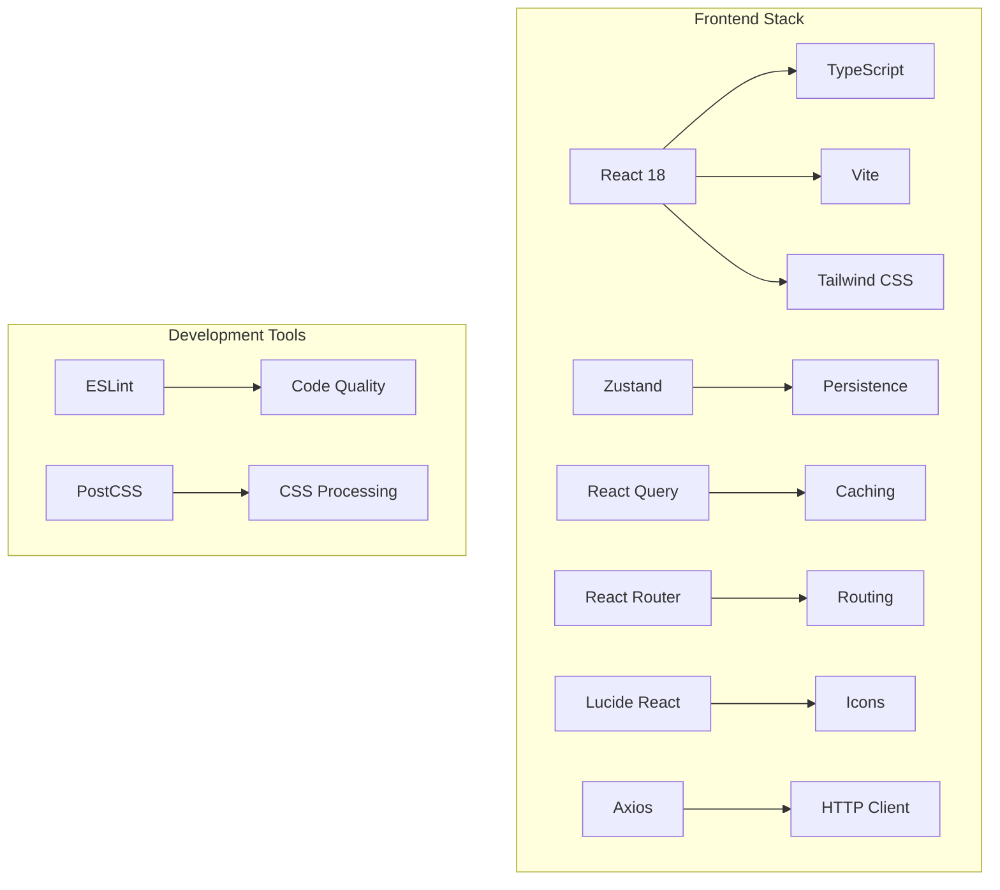
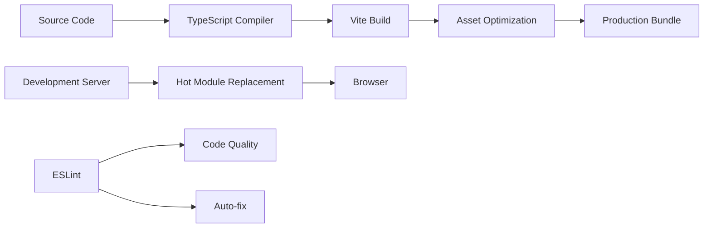

# Frontend Architecture Documentation

This document provides detailed technical architecture and implementation patterns for the RAG Knowledge Assistant React application.

## 🏗️ Architecture Overview

### Design Principles

The application follows **modern React best practices** with emphasis on:

- **Component-Driven Development**: Reusable, testable components
- **Separation of Concerns**: Clear boundaries between UI, state, and logic
- **Type Safety**: Comprehensive TypeScript coverage
- **Performance**: Optimized rendering and data fetching
- **Accessibility**: WCAG compliance considerations
- **Mobile-First**: Responsive design approach

### Technology Stack



## 🏢 Component Architecture

### Hierarchy Pattern

```
App.tsx (Root)
├── Router Configuration
├── Authentication Provider
└── Query Client Provider

Layout.tsx (Shell)
├── Sidebar Navigation
├── Header with User Info
├── Main Content Area
└── Mobile Menu Handler

Pages/
├── DashboardPage.tsx
├── ChatPage.tsx
├── DocumentsPage.tsx
├── WorkspacesPage.tsx
├── SettingsPage.tsx
└── auth/
    ├── LoginPage.tsx
    └── RegisterPage.tsx

Components/
├── ui/ (Base Components)
│   ├── Button.tsx
│   ├── Input.tsx
│   ├── Card.tsx
│   └── Label.tsx
├── auth/
│   └── ProtectedRoute.tsx
└── layout/
    └── Layout.tsx
```

### Component Patterns

#### Functional Components with Hooks
```typescript
// Example: Button Component
interface ButtonProps {
  variant?: 'primary' | 'secondary' | 'outline'
  size?: 'sm' | 'md' | 'lg'
  children: React.ReactNode
  onClick?: () => void
}

const Button: React.FC<ButtonProps> = ({
  variant = 'primary',
  size = 'md',
  children,
  onClick,
  ...props
}) => {
  return (
    <button
      className={cn(buttonVariants({ variant, size }))}
      onClick={onClick}
      {...props}
    >
      {children}
    </button>
  )
}
```

#### Composition Pattern
```typescript
// Example: Card Component
const Card = React.forwardRef<HTMLDivElement, CardProps>(
  ({ className, children, ...props }, ref) => (
    <div
      ref={ref}
      className={cn(cardBaseClass, className)}
      {...props}
    >
      {children}
    </div>
  )
)

// Sub-components for composition
Card.Header = CardHeader
Card.Title = CardTitle
Card.Content = CardContent
Card.Footer = CardFooter
```

## 🗂️ State Management

### Zustand Store Pattern

```typescript
// Auth Store Example
interface AuthState {
  user: User | null
  accessToken: string | null
  refreshToken: string | null
  isAuthenticated: boolean
  isLoading: boolean
  error: string | null
}

interface AuthActions {
  login: (email: string, password: string) => Promise<void>
  register: (userData: UserRegistration) => Promise<void>
  logout: () => void
  refreshAccessToken: () => Promise<void>
  initializeAuth: () => void
}

export const useAuthStore = create<AuthState & AuthActions>()(
  persist(
    (set, get) => ({
      // State
      user: null,
      accessToken: null,
      refreshToken: null,
      isAuthenticated: false,
      isLoading: false,
      error: null,

      // Actions
      login: async (email, password) => {
        set({ isLoading: true, error: null })
        try {
          const response = await authService.login(email, password)
          const { access_token, refresh_token } = response.data
          
          // Get user info
          const user = await authService.getCurrentUser()
          
          set({
            user,
            accessToken: access_token,
            refreshToken: refresh_token,
            isAuthenticated: true,
            isLoading: false
          })
        } catch (error) {
          set({ error: error.message, isLoading: false })
        }
      },
      
      logout: () => {
        // Clear tokens and user data
        localStorage.removeItem(STORAGE_KEYS.ACCESS_TOKEN)
        localStorage.removeItem(STORAGE_KEYS.REFRESH_TOKEN)
        localStorage.removeItem(STORAGE_KEYS.USER)
        
        set({
          user: null,
          accessToken: null,
          refreshToken: null,
          isAuthenticated: false
        })
      }
    }),
    {
      name: 'auth-store',
      partialize: (state) => ({
        user: state.user,
        accessToken: state.accessToken,
        refreshToken: state.refreshToken,
        isAuthenticated: state.isAuthenticated
      })
    }
  )
)
```

### State Synchronization

```typescript
// React Query Integration
const { data: documents, isLoading, error } = useQuery({
  queryKey: ['documents', workspaceId],
  queryFn: () => documentService.list(),
  enabled: !!workspaceId,
  staleTime: 5 * 60 * 1000, // 5 minutes
  cacheTime: 10 * 60 * 1000, // 10 minutes
})

// Mutation with cache invalidation
const uploadMutation = useMutation({
  mutationFn: documentService.upload,
  onSuccess: () => {
    queryClient.invalidateQueries(['documents'])
  }
})
```

## 🌐 API Integration

### Service Layer Architecture

```typescript
// Base Service Pattern
abstract class BaseService {
  protected static async request<T>(
    endpoint: string,
    options?: AxiosRequestConfig
  ): Promise<T> {
    const response = await api.request<T>({
      url: endpoint,
      ...options
    })
    return response.data
  }
}

// Document Service Example
class DocumentService extends BaseService {
  static async upload(file: File, onProgress?: (progress: number) => void): Promise<Document> {
    const formData = new FormData()
    formData.append('file', file)
    
    return this.request('/api/v1/documents/upload', {
      method: 'POST',
      data: formData,
      headers: { 'Content-Type': 'multipart/form-data' },
      onUploadProgress: (progressEvent) => {
        if (onProgress) {
          const progress = Math.round(
            (progressEvent.loaded * 100) / progressEvent.total
          )
          onProgress(progress)
        }
      }
    })
  }

  static async list(): Promise<Document[]> {
    return this.request('/api/v1/documents/')
  }
}
```

### HTTP Client Configuration

```typescript
// Axios Instance with Interceptors
const apiClient = axios.create({
  baseURL: API_BASE_URL,
  timeout: 30000,
  headers: {
    'Content-Type': 'application/json'
  }
})

// Request Interceptor
apiClient.interceptors.request.use((config) => {
  const token = getStoredToken()
  if (token) {
    config.headers.Authorization = `Bearer ${token}`
  }
  return config
})

// Response Interceptor
apiClient.interceptors.response.use(
  (response) => response,
  async (error) => {
    if (error.response?.status === 401) {
      try {
        await refreshAccessToken()
        return retryOriginalRequest(error.config)
      } catch (refreshError) {
        // Redirect to login on refresh failure
        window.location.href = '/login'
      }
    }
    return Promise.reject(error)
  }
)
```

## 🔐 Security Architecture

### JWT Token Management

```typescript
// Token Storage Strategy
interface TokenStorage {
  accessToken: string | null
  refreshToken: string | null
  expiresAt: number | null
}

class TokenManager {
  static setTokens(accessToken: string, refreshToken: string): void {
    const expiresAt = Date.now() + JWT_CONSTANTS.ACCESS_TOKEN_EXPIRY
    localStorage.setItem(STORAGE_KEYS.ACCESS_TOKEN, accessToken)
    localStorage.setItem(STORAGE_KEYS.REFRESH_TOKEN, refreshToken)
    localStorage.setItem('token_expires_at', expiresAt.toString())
  }

  static getAccessToken(): string | null {
    const token = localStorage.getItem(STORAGE_KEYS.ACCESS_TOKEN)
    const expiresAt = localStorage.getItem('token_expires_at')
    
    if (!token || !expiresAt) return null
    
    // Check expiry
    const isExpired = Date.now() > parseInt(expiresAt)
    if (isExpired) {
      this.clearTokens()
      return null
    }
    
    return token
  }

  static async refreshTokens(): Promise<boolean> {
    const refreshToken = localStorage.getItem(STORAGE_KEYS.REFRESH_TOKEN)
    if (!refreshToken) return false
    
    try {
      const response = await authService.refresh(refreshToken)
      this.setTokens(response.access_token, response.refresh_token)
      return true
    } catch {
      this.clearTokens()
      return false
    }
  }
}
```

### Authentication Flow

```mermaid
sequenceDiagram
    participant User as U
    participant Frontend as F
    participant Backend as B
    
    U->>F: Enters credentials
    F->>B: POST /auth/login
    B-->>F: Returns JWT tokens
    F->>F: Stores tokens securely
    U->>F: Navigates to protected route
    F->>B: Request with Authorization header
    B-->>F: Returns data or 401
    alt Token Expired?
        B-->>F: 401 Unauthorized
        F->>F: Attempts token refresh
        F->>B: POST /auth/refresh
        B-->>F: Returns new tokens
        F->>F: Updates stored tokens
        F->>B: Retries original request
        B-->>F: Returns data
    else
        B-->>F: Returns data
```

## 🎨 UI Architecture

### Design System

```typescript
// Theme Configuration
interface ThemeConfig {
  colors: {
    primary: string
    secondary: string
    accent: string
    background: string
    foreground: string
    muted: string
  }
  borderRadius: string
  fontFamily: {
    sans: string[]
    mono: string[]
  }
}

// Tailwind Config with Custom Theme
const themeConfig: ThemeConfig = {
  colors: {
    primary: 'hsl(221, 83%, 53%)',
    secondary: 'hsl(210, 40%, 98%)',
    accent: 'hsl(210, 40%, 96%)',
    background: 'hsl(0, 0%, 100%)',
    foreground: 'hsl(222, 84%, 5%)',
    muted: 'hsl(210, 40%, 96%)'
  },
  borderRadius: '0.5rem',
  fontFamily: {
    sans: ['Inter', 'system-ui'],
    mono: ['JetBrains Mono', 'monospace']
  }
}
```

### Component Variants Pattern

```typescript
// Class Variance Authority (CVA)
import { cva, type VariantProps } from 'class-variance-authority'

const buttonVariants = cva(
  'inline-flex items-center justify-center rounded-md font-medium transition-colors',
  {
    variants: {
      variant: {
        primary: 'bg-primary text-primary-foreground hover:bg-primary/90',
        secondary: 'bg-secondary text-secondary-foreground hover:bg-secondary/80',
        outline: 'border border-input bg-background hover:bg-accent hover:text-accent-foreground'
      },
      size: {
        sm: 'h-9 px-3 text-sm',
        md: 'h-10 px-4 py-2',
        lg: 'h-11 px-8 text-lg'
      }
    }
  }
)

type ButtonProps = VariantProps<typeof buttonVariants>
```

## 📱 Responsive Architecture

### Breakpoint System

```typescript
// Responsive Breakpoints
const breakpoints = {
  mobile: '0px',      // < 768px
  tablet: '768px',     // 768px - 1024px
  desktop: '1024px',   // > 1024px
  wide: '1280px'      // > 1280px
}

// Mobile-First CSS Approach
.container {
  @apply max-w-7xl mx-auto px-4 sm:px-6 lg:px-8;
}

.grid {
  @apply grid grid-cols-1 md:grid-cols-2 lg:grid-cols-3 gap-6;
}
```

### Adaptive Components

```typescript
// Responsive Hook
const useBreakpoint = () => {
  const [breakpoint, setBreakpoint] = useState(getBreakpoint())

  useEffect(() => {
    const handleResize = () => setBreakpoint(getBreakpoint())
    window.addEventListener('resize', handleResize)
    return () => window.removeEventListener('resize', handleResize)
  }, [])

  return breakpoint
}

// Conditional Rendering
const ResponsiveComponent = () => {
  const breakpoint = useBreakpoint()
  
  return (
    <div>
      {breakpoint === 'mobile' && <MobileLayout />}
      {breakpoint === 'tablet' && <TabletLayout />}
      {breakpoint === 'desktop' && <DesktopLayout />}
    </div>
  )
}
```

## 🚀 Performance Architecture

### Code Splitting

```typescript
// Route-based Code Splitting
import { lazy, Suspense } from 'react'

const DashboardPage = lazy(() => import('./pages/DashboardPage'))
const ChatPage = lazy(() => import('./pages/ChatPage'))

const App = () => (
  <Router>
    <Suspense fallback={<LoadingSpinner />}>
      <Routes>
        <Route path="/dashboard" element={<DashboardPage />} />
        <Route path="/chat" element={<ChatPage />} />
      </Routes>
    </Suspense>
  </Router>
)
```

### Caching Strategy

```typescript
// React Query Configuration
const queryClient = new QueryClient({
  defaultOptions: {
    queries: {
      staleTime: 5 * 60 * 1000,     // 5 minutes
      cacheTime: 10 * 60 * 1000,   // 10 minutes
      retry: (failureCount, error) => {
        if (error.status === 404) return false
        return failureCount < 3
      }
    },
    mutations: {
      retry: 1
    }
  }
})

// Selective Cache Invalidation
const invalidateRelatedQueries = (documentId: string) => {
  queryClient.invalidateQueries(['documents'])
  queryClient.invalidateQueries(['chat-history'])
  queryClient.invalidateQueries(['workspace-stats'])
}
```

## 🧪 Testing Architecture

### Component Testing

```typescript
// Example Component Test
import { render, screen, fireEvent } from '@testing-library/react'
import { Button } from '../Button'

describe('Button Component', () => {
  it('renders with correct variant', () => {
    render(<Button variant="primary">Click me</Button>)
    expect(screen.getByRole('button')).toHaveClass('bg-primary')
  })

  it('handles click events', () => {
    const handleClick = jest.fn()
    render(<Button onClick={handleClick}>Click me</Button>)
    
    fireEvent.click(screen.getByRole('button'))
    expect(handleClick).toHaveBeenCalledTimes(1)
  })
})
```

### Integration Testing

```typescript
// API Integration Test
import { renderHook, waitFor } from '@testing-library/react'
import { useAuthStore } from '../stores/authStore'

describe('Auth Store Integration', () => {
  it('handles login flow', async () => {
    const { result } = renderHook(() => useAuthStore())
    
    await act(async () => {
      await result.current.login('test@example.com', 'password')
    })
    
    expect(result.current.isAuthenticated).toBe(true)
    expect(result.current.user).toBeTruthy()
  })
})
```

## 🔧 Development Architecture

### Build System



### Development Workflow

```bash
# Development Commands
npm run dev          # Start dev server with HMR
npm run build        # Production build
npm run preview      # Preview production build
npm run lint         # Code quality check
npm run type-check   # TypeScript validation

# Git Hooks
pre-commit: npm run lint && npm run type-check
pre-push: npm run test
```

## 📊 Monitoring & Analytics

### Performance Monitoring

```typescript
// Performance Metrics
interface PerformanceMetrics {
  renderTime: number
  bundleSize: number
  loadTime: number
  memoryUsage: number
}

// Performance Hook
const usePerformance = () => {
  const [metrics, setMetrics] = useState<PerformanceMetrics>()
  
  useEffect(() => {
    const observer = new PerformanceObserver((list) => {
      for (const entry of list.getEntries()) {
        if (entry.entryType === 'navigation') {
          setMetrics({
            loadTime: entry.loadEvent?.end - entry.loadEvent?.start,
            renderTime: entry.domContentLoadedEventEnd - entry.domContentLoadedEventStart
          })
        }
      }
    })
    
    observer.observe({ entryTypes: ['navigation'] })
  }, [])
  
  return metrics
}
```

### Error Tracking

```typescript
// Error Boundary
class ErrorBoundary extends React.Component {
  state = { hasError: false, error: null }
  
  static getDerivedStateFromError(error) {
    return { hasError: true, error }
  }
  
  componentDidCatch(error, errorInfo) {
    // Log error to monitoring service
    console.error('Error caught by boundary:', error, errorInfo)
    
    // Send to error tracking service
    errorTrackingService.captureException(error, {
      extra: errorInfo
    })
  }
}
```

## 🚀 Deployment Architecture

### Build Optimization

```typescript
// Vite Configuration for Production
export default defineConfig({
  plugins: [react()],
  build: {
    target: 'es2015',
    minify: 'terser',
    sourcemap: true,
    rollupOptions: {
      output: {
        manualChunks: {
          vendor: ['react', 'react-dom'],
          router: ['react-router-dom'],
          query: ['@tanstack/react-query'],
          ui: ['./src/components/ui']
        }
      }
    }
  },
  optimizeDeps: {
    include: ['react', 'react-dom']
  }
})
```

### Environment Configuration

```typescript
// Environment Types
interface Environment {
  VITE_API_URL: string
  VITE_APP_NAME: string
  VITE_APP_VERSION: string
  VITE_ENABLE_ANALYTICS: string
}

// Configuration Validation
const validateEnvironment = (): Environment => {
  const required = ['VITE_API_URL']
  const missing = required.filter(key => !import.meta.env[key])
  
  if (missing.length > 0) {
    throw new Error(`Missing required environment variables: ${missing.join(', ')}`)
  }
  
  return import.meta.env as Environment
}
```

---

This architecture documentation provides comprehensive technical guidance for understanding, maintaining, and extending the RAG Knowledge Assistant frontend application.
